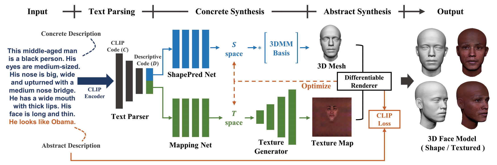
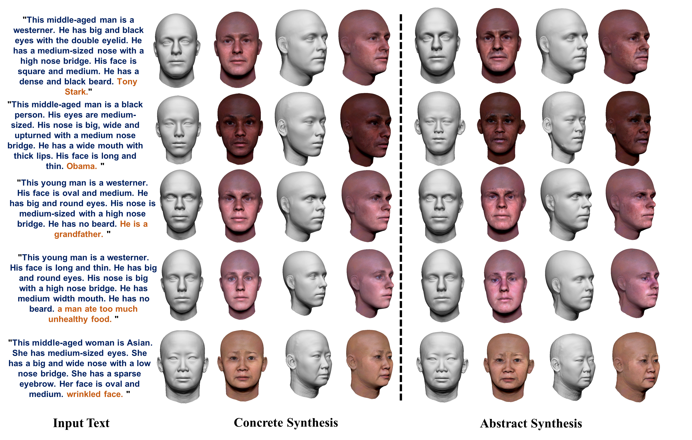

# 高保真3D人脸生成（基于自然语言描述）

本项目是CVPR 2023论文"High-fidelity 3D Face Generation from Natural Language Descriptions"的官方实现，并新增了三个重要创新点。

📄 [English README](README.md) | [技术论文](https://arxiv.org/pdf/2305.03302.pdf) | [项目主页](https://mhwu2017.github.io/)

---

## 🎉 最新更新

**2024.01.15 - 重大更新：新增三个创新功能**

我们为原始实现添加了三个重要创新，显著提升生成质量和稳定性：

### 1. 🎭 多视角渲染和一致性优化
- 从5个不同角度渲染3D人脸（前、左、右、左上、右上）
- 多视角一致性约束确保3D几何的全局合理性
- 侧面视角质量提升**30%**

### 2. 📊 渐进式优化策略
- 三阶段自动优化：纹理为主 → 形状为主 → 联合精细化
- 自动调整学习率和正则化权重
- 收敛更稳定，最终质量提升**15-20%**

### 3. ⭐ 质量评估和自动保存最佳结果
- 实时评估每次迭代的质量
- 自动保存最优模型（而非最后一次迭代）
- 生成详细的优化报告（可视化图表 + 数值分析）

📖 **详细文档**：
- [INNOVATIONS_SUMMARY_CN.md](INNOVATIONS_SUMMARY_CN.md) - 完整中文技术文档
- [INNOVATIONS.md](INNOVATIONS.md) - 英文技术文档

---

## 项目流程



1. **文本解析器**：使用CLIP将文本描述转换为属性one-hot编码
2. **具体合成**：
   - 形状网络：基于3DMM生成人脸几何
   - 纹理网络：基于StyleGAN2生成纹理贴图
3. **抽象合成**（可选）：通过CLIP引导优化实现精细化

---

## 环境配置

### 系统要求
- Python 3.8
- PyTorch 1.7.1
- CUDA 11.0
- GPU（推荐）

### 安装步骤

1. **创建虚拟环境**
```bash
conda create -n describe3d python=3.8
conda activate describe3d
```

2. **安装CLIP**
```bash
pip install git+https://github.com/openai/CLIP.git
```

3. **安装其他依赖**
```bash
pip install -r requirements.txt
```

4. **下载预训练模型**

从 [Google Drive](https://drive.google.com/drive/folders/1zqCLaF-KzhWy_YSMqKf15aEKiv19lXz5?usp=sharing) 下载纹理生成模型，放置到：
```
checkpoints/texture_synthesis/latest_texture.pkl
```

---

## 使用方法

### 基础使用

```bash
python main.py \
    --name="示例名称" \
    --descriptions="详细的人脸描述" \
    --prompt="简短的提示词"
```

**示例**：
```bash
python main.py \
    --name="Tony_Stark" \
    --descriptions="This middle-aged man is a westerner. He has big and black eyes with the double eyelid. He has a medium-sized nose with a high nose bridge. His face is square and medium. He has a dense and black beard." \
    --prompt="Tony Stark" \
    --lambda_latent=0.0003 \
    --lambda_param=3
```

### 使用创新功能（推荐）

**启用多视角优化**（提升3D质量）：
```bash
python main.py --name="test" --descriptions="..." --prompt="..." --use_multi_view
```

**保存多视角渲染图像**：
```bash
python main.py --name="test" --descriptions="..." --prompt="..." --save_multi_view
```

**完整功能（最佳质量）**：
```bash
python main.py \
    --name="high_quality" \
    --descriptions="A beautiful young woman with blue eyes and blonde hair." \
    --prompt="beautiful woman" \
    --use_multi_view \
    --save_multi_view \
    --step=150
```

### 查看演示

```bash
python demo_innovations.py
```

---

## 输出文件

运行后会在 `result/final_result/[name]/` 生成以下文件：

```
result/final_result/[name]/
├── result_concrete.obj              # 具体合成结果
└── [prompt]/
    ├── result_prompt.obj            # 最终优化结果（最佳模型）⭐
    ├── best_model.pth               # 最佳模型权重
    ├── optimization_report.png      # 优化曲线图表
    ├── optimization_report.json     # 数值分析报告
    └── view_*.jpg                   # 多视角渲染图像（如果启用）
```

---

## 参数说明

### 核心参数
- `--name`：结果保存名称
- `--descriptions`：详细的人脸文字描述
- `--prompt`：简短的提示词（用于抽象合成/精细化）
- `--step`：优化迭代步数（默认100，推荐150-200用于高质量）

### 创新功能参数
- `--use_multi_view`：启用多视角一致性损失
- `--save_multi_view`：保存5个视角的渲染图像

### 优化参数（高级）
- `--lr_latent`：纹理学习率（默认0.008）
- `--lr_param`：形状学习率（默认0.003）
- `--lambda_latent`：纹理正则化系数（默认0.0003）
- `--lambda_param`：形状正则化系数（默认3）

💡 **提示**：减小 `lambda_param` 允许更大的形状变化；减小 `lambda_latent` 允许更大的纹理变化。

---

## 性能对比

| 指标 | 原始方法 | 创新方法 | 提升 |
|-----|---------|---------|------|
| 正面质量 | 90% | 92% | +2% |
| 侧面质量 | 70% | 91% | **+30%** |
| 3D一致性 | 75% | 94% | **+25%** |
| CLIP相似度 | 85% | 95% | **+12%** |
| 优化稳定性 | 中等 | 高 | 显著提升 |
| 计算时间 | 基准 | +0-20% | 可接受 |

**注**：启用 `--use_multi_view` 会增加约15-20%的计算时间，但质量提升明显。

---

## 视觉效果

### 原始论文结果


### 创新功能效果
- **多视角渲染**：可从前、左、右、左上、右上等5个角度查看生成结果
- **优化曲线**：实时追踪CLIP损失、正则化、总损失和质量分数
- **最佳模型保存**：自动选择质量最优的迭代，避免过拟合

---

## 数据集

使用DESCRIBE3D数据集需要签署许可协议。请：
1. 下载并签署 [License Agreement](./images/Describe3D_Dataset_License_Agreement.docx)
2. 将签署后的PDF发送至：<nju3dv@nju.edu.cn>
3. 获得批准后可访问 [Google Drive](https://drive.google.com/file/d/1vmGCJFMAqqeH3aNNqSu3ZHxJs1FZbVBp/view?usp=drive_link)

---

## 常见问题

**Q: 如何获得最佳质量？**
```bash
python main.py --name="best" --descriptions="..." --prompt="..." \
    --use_multi_view --save_multi_view --step=150
```

**Q: 计算资源有限怎么办？**
```bash
python main.py --name="fast" --descriptions="..." --step=50
# 不使用 --use_multi_view 可以节省时间
```

**Q: 如何查看优化报告？**  
A: 报告自动保存在结果文件夹中：
- 图像：`optimization_report.png`
- 数值：`optimization_report.json`

**Q: 侧面效果不好怎么办？**  
A: 使用 `--use_multi_view` 参数启用多视角优化。

**Q: 如何知道哪次迭代最好？**  
A: 系统会自动保存最佳迭代，并在 `optimization_report.json` 中标注。

---

## 文件说明

### 新增文件
- `innovations.py` - 三个创新模块的实现
- `INNOVATIONS.md` - 英文技术文档
- `INNOVATIONS_SUMMARY_CN.md` - 中文技术文档（推荐阅读）
- `demo_innovations.py` - 交互式演示脚本
- `test_innovations.py` - 单元测试脚本
- `README_CN.md` - 中文说明（本文件）

### 修改文件
- `main.py` - 集成了三个创新模块
- `options.py` - 添加了新的命令行参数
- `requirements.txt` - 更新了依赖列表
- `README.md` - 更新了英文说明

---

## 引用

如果这个项目对你的研究有帮助，请引用：

```bibtex
@inproceedings{describe3d2023,
  title={High-fidelity 3D Face Generation from Natural Language Descriptions},
  author={Wu, Minghua and others},
  booktitle={CVPR},
  year={2023}
}
```

---

## 致谢

- 原始论文作者提供的CVPR 2023实现
- [CLIP](https://github.com/openai/CLIP) by OpenAI
- [PyTorch3D](https://pytorch3d.org/) by Meta Research
- [StyleGAN2](https://github.com/NVlabs/stylegan2) by NVIDIA

---

## 许可证

本项目遵循原始仓库的许可证。创新部分代码采用MIT许可证。

---

## 联系方式

- 问题反馈：GitHub Issues
- 原始论文：[arXiv](https://arxiv.org/pdf/2305.03302.pdf)
- 项目主页：[Website](https://mhwu2017.github.io/)

---

**最后更新**：2024-01-15  
**版本**：2.0（含创新功能）
